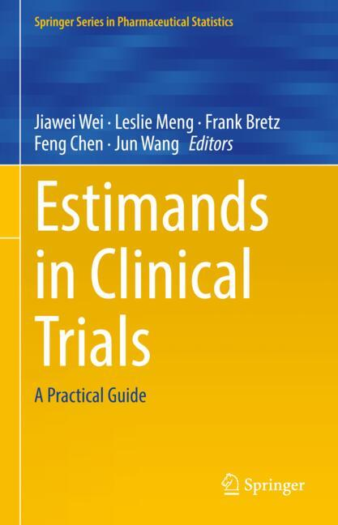

## What is an estimand?

From the glossary of the [ICH E9: estimands addendum](https://database.ich.org/sites/default/files/E9-R1_Step4_Guideline_2019_1203.pdf):

_A precise description of the treatment effect reflecting the clinical question posed by the trial objective. It summarises at a population-level what the outcomes would be in the same patients under different treatment conditions being compared._

## Where should I start?

The [trainings](trainings.html) page is a starting point. 

Further, a [3min intro video](https://www.youtube.com/watch?v=oeoTOOlx37c) is available: *What is an estimand in a clinical trial: The PIONEER 1 example*.

The book from Jiawei Wei, Leslie Meng, Frank Bretz, Feng Chen and Jun Wang (editors) **Estimands in Clinical Trials - A Practical Guide** (ISBN:978-3-032-02191-5) provides a comprehensive, up-to-date, and practical introduction to the estimand framework and its application in clinical trials. 

See also the [publications](publications.html) page regarding work from the EIWG. Recently, members of the EIWG have prepared topics on ICH E9(R1) [requiring further clarification](/publications/Questions-to-ICH-E9-WG-final-19-Dec-25.pdf).  